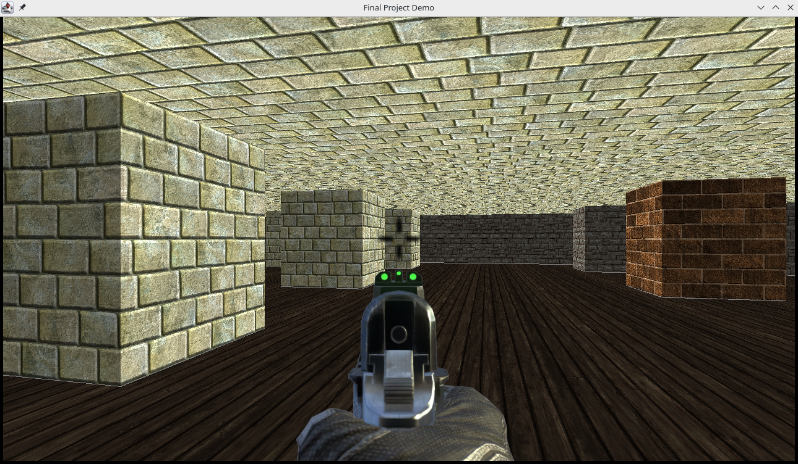

# Java Raycasting Demo

# Table of Contents

1.  [Overview](#org3ffd5b9)
2.  [Project Goals](#org9fc8975)
3.  [Components](#org86a9e4d)
    1.  [Driver / Panel](#org0ac4051)
    2.  [Display](#orgc352fc8)
    3.  [Screen](#org4200575)
    4.  [Camera / Controls](#org87f166f)
    5.  [Resources](#orgcd919df)
    6.  [Menu](#org860c28e)

# Overview

A few years ago, I took a computer science class which focused on
Java, covering similar topics to AP Computer Science. We chose our own
final projects, which were undertaken in groups of three. My group
aimed to create a simple first person 3D game, in the style of the
venerable Doom. I worked with two other students to design the program
and meet class requirements, but almost all of the code in the final
product is my work. The results of the effort are in this repository.

The `final` directory contains the code that my group turned in at the
end of the class, which is a 3D engine in which the user can navigate
arbitrary worlds of a single z-level. Maps may be switched, and
positions saved and loaded, at runtime. The `demo` directory contains
three test applications I and other group members built along the
way. There is also a UML diagram for the final application in the main
directory. I do not think this method of breaking down a program is
useful, but we were required to create such a diagram.

# Project Goals

-   Embark on a fully self directed application development project,
    from inception to implementation
-   Work with a group to effectively design a program and meet
    requirements imposed by the customer
-   Understand the structure of an object oriented program with several
    interacting components
-   Write the project in Java, the language of choice for the class,
    which is also often used in industry
-   Take user input, provide graphical output, and demonstrate reading
    from and writing to files
-   Divide important functions into a variety of source files, each of
    which fulfills a clear purpose
-   Create a simplistic 3D first person game using the relatively simple
    raycasting technique for rendering
-   Allow a player to move around maps of any size and layout, and
    appear to use a weapon
-   Provide interactions with enemies and possibly other sprites that
    may inhabit the map

# Components

This application is divided into several components, in order to make
the structure easier to understand and to make use of Java's object
oriented programming paradigm. Together, they define the program's
behavior and operate in concert at runtime.

The driver, at `GameDriver.java`, is the single point of entry for the
program. It initializes the graphical frame, which is drawn to by the
panel.

This panel, in `GamePanel.java`, mediates all the components of
the program, starting up the display and the various listeners that
check for user input.

Most graphics are managed by `Display.java`. This file oversees the
camera and screen (renderer). It takes care of drawing, loading, and
saving.

Rendering the map is the work of `Screen.java`. It uses a raycasting
algorithm to determine and draw what of the map is visible from the
player's camera position.

Stored in `Camera.java`, the camera code tracks all camera position
variables and provides the functions to update camera position based
on player input.

The key listener is implemented in `Controls.java`. It is used to
track when a player presses or releases any key bound to a movement.

Various resources are managed by `Map.java`, `Texture.java`, and
`Wall.java`. Other components use this code to interact with external
files.

A pause menu is defined in `Menu.java`. This provides the option to
change the map; the player may also save or load a position and
heading.

## Driver / Panel

So named because it "drives" the rest of the program, the driver is
where execution begins. Once the entire program has been compiled to
Java bytecode (since Java manages to be both compiled and
interpreted), running `GameDriver.class` starts the application. The
driver is brief, only creating a frame on the desktop and initializing
the panel, which populates the frame with the program's generated
images. The entire application makes use of the Java Swing graphics
library to draw various images.

The panel is the core of the program; its name comes from the fact
that it creates the entire panel inside the application's graphical
frame. All relevant keyboard and mouse events are tracked by the panel
and passed along to other relevant components. It is also constantly,
every few milliseconds, using the display component to generate the
next frame of 3D graphics. When the user pauses the game, the panel
stops generating frames and overlays a menu on the frozen image; it
also tracks clicks of the menu's buttons.

## Display

A number of graphics layers are composited together to create the
final image shown to a player. The Display class creates the player's
view of the world by combining a rendered frame with a persistent
targeting overlay. It keeps track of the camera position at every
moment; to generate a frame, all the characteristics of the camera
(position, heading, etc) are fed into the rendering function, known as
the screen. The output, which is a rendered view of the 3D world from
a particular perspective, is combined with the overlay and passed up
to the panel.

Each frame that the player is moving or rotating, the display also
changes the camera position and heading slightly in the appropriate
direction. Since this file handles the camera, map, and textures and
uses them to generate each frame, it provides the save and load
functions as well. A player may choose a map from available map
definition files, save their camera position on the current map, or
load a saved map and camera position. These functions are triggered
from buttons on the pause menu.

## Screen

I am unsure of how the name "screen" for the renderer originated. It
is almost entirely composed of a function called `update`, which uses
the camera position and map layout to render a 2D image of the 3D
space. It uses a simple raycasting algorithm, in which many "rays" are
projected from the camera position, and the point at which they
encounter a solid part of the map is recorded. Each ray corresponds to
a single pixel of the rendered image, so the texture of the wall each
ray encounters determines the color of that pixel.

The rays fan out from the plane representing the player's view, giving
an impression of perspective. For each one that hits a solid part of
the map, the appropriate texture is scaled based on the distance from
the camera. We determine the X and Y values on the texture of the
point the ray touched, and the texture's color at this point becomes
the color of the pixel. Whenever a ray does not touch a solid part of
the map, the empty space is filled in with a predetermined ceiling or
floor texture.

Rendering with raycasting is simplistic, but met my goals for this
project. All parts of the map occlude properly, the perspective looks
right, and the player indeed feels like they are walking around a
particularly angular world. If I were inclined to develop this program
further, I would add support for 2D sprites rendered as part of the
screen code, to represent enemies or other objects in the
environment. It would not be particularly difficult to add mobile,
properly occluded sprites to the engine.

## Camera / Controls

A player using this application changes the position and heading of a
camera moving through the map's coordinate space. All attributes of
the camera, and all methods to change the camera position, are stored
in one class. The significance of the camera coordinates and heading
is that they are fed into the renderer. These values indicate the
location, direction, and size of the plane from which the rays are
projected during the rendering process.

Changing the camera attributes is only done through user input, which
comes through the mouse and keyboard. The mouse position is frequently
checked by the panel, but the Controls class listens for relevant
keypresses. Every time the player presses or releases a movement key,
such as an arrow key, the program receives an event. By creating
distinct events for presses and releases, it is possible to move the
camera constantly as long as a key is held down.

## Resources

Several external resources are essential to this application,
including several textures and two types of text files. The Texture
class simply loads texture images into an array of pixels that can be
used for rendering. The Wall class extends Texture, implementing an
appropriate loading function. There are a small number of possible
wall textures, and each one is represented as a different instance of
Wall. During rendering, the map file determines which instance the
texture will be retrieved from.

This map file is simple in structure: first is the size of the map in
X and Y directions, then the position at which the player will start
when the map is loaded, then a grid of space separated digits. The
digit 0 represents an empty space, and 1 thru 3 represent walls of
different textures. The Map class loads a particular map by reading
it from the text file and storing it in an array. This instance can
then be queried for the start position and wall locations during
startup and rendering.

The save file is simple; it stores the file location of the map in
which the position was saved, as well as the six values that describe
the camera's state. A player can save this information at any time
from the pause menu. They may choose later to load the currently saved
position. This feature is a good demonstration, but would be more
useful if the project were actually built out into a game, as was
originally intended. Support for other resources would be added in
this case as well.

## Menu

A pause menu was a later addition to this application, part of my
efforts to turn the engine into a complete game. This work did not
come to fruition before the project due date, but the menu provides
some interesting features nonetheless. I used Java graphics libraries
to construct the graphical user interface out of text components and
buttons. These are connected to listeners, which trigger appropriate
functions when a player clicks the buttons.

Further development would add more to the menu, but the current
features are a runtime map selector and a save / load function. The
code for these functions is implemented in other components, and the
panel connects everything together. The menu code itself just lays out
the format of the menu's text and buttons. For a bigger interface, I
would prefer to define the menu appearance with a markup language, but
laying things out in regular code works for this purpose.

